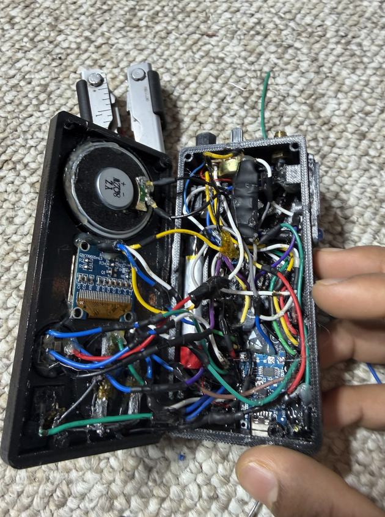
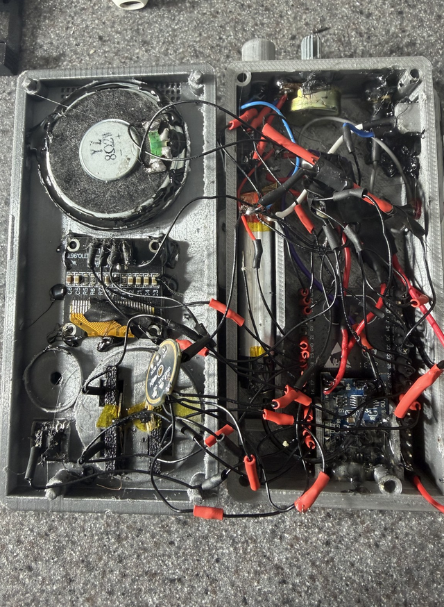
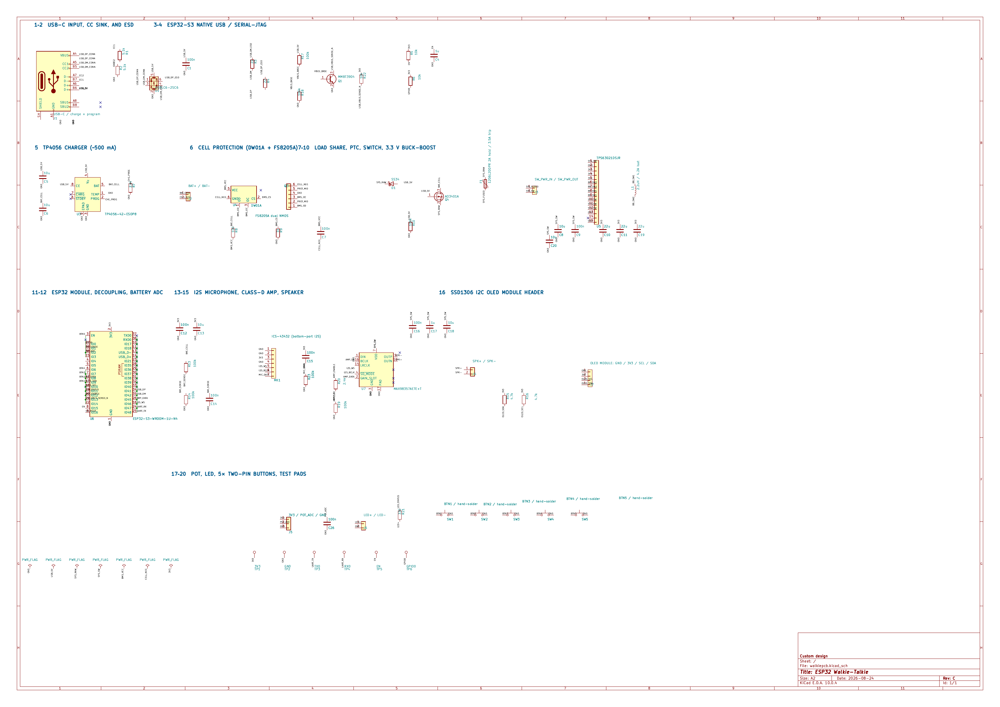
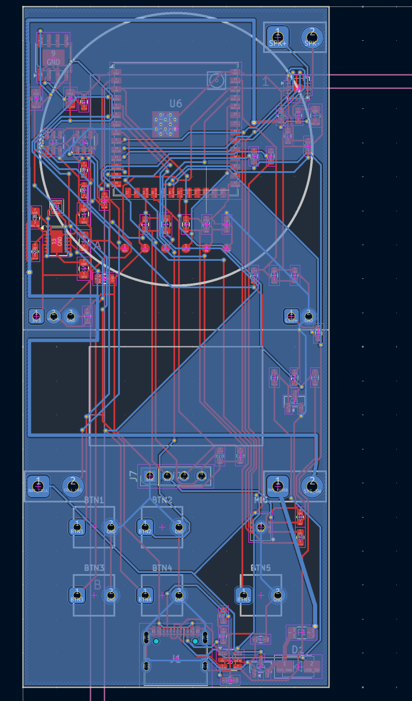
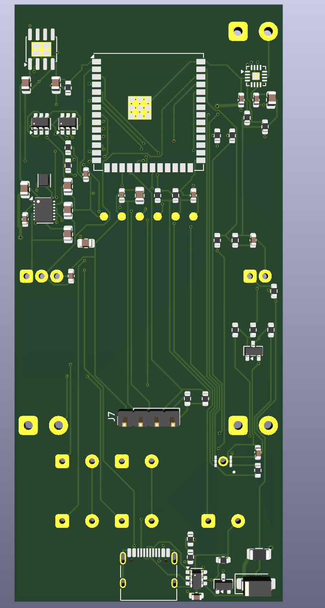
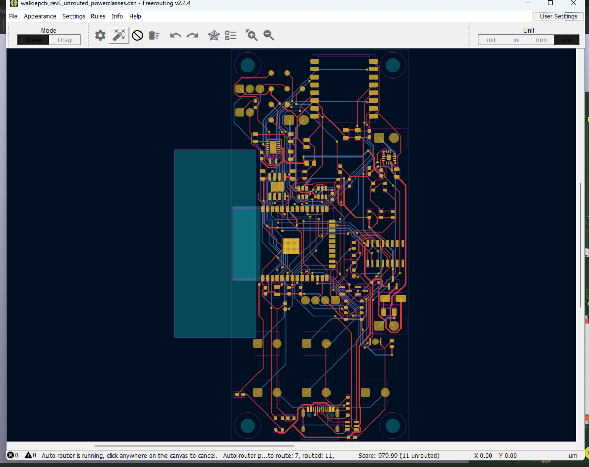
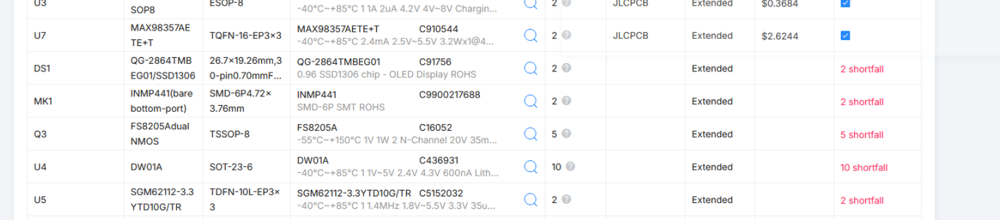
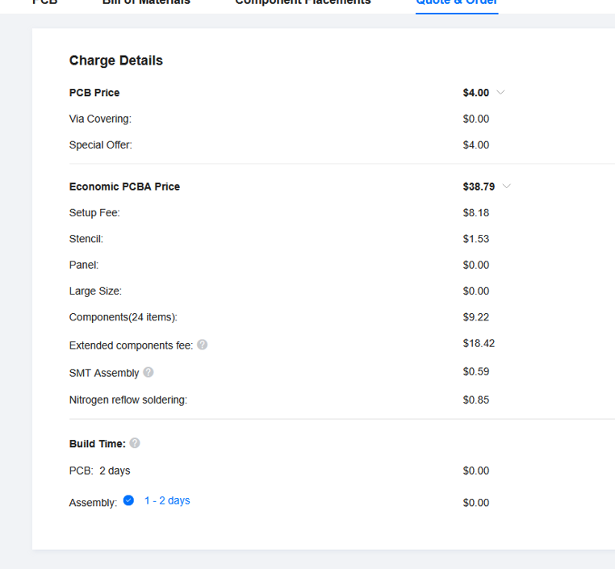
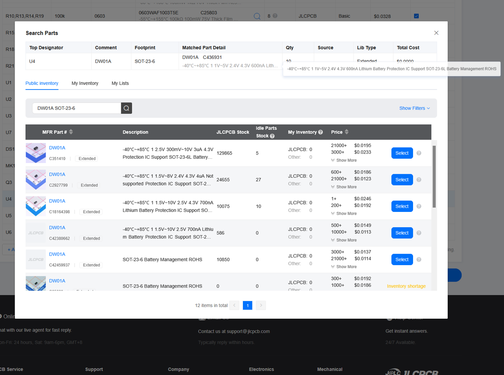

# 2026-08-24 - Evaluating Project Goals

**Time: 1:24 PM**

Time to brainstorm my PCB. I recently created a PCB for this project but that was because my previous SHIP guy rejected it and told me to make a PCB for it. I followed the directions and made a PCB but it was very bad and not optimal. My original design was meant to be hard soldered.

Now, I want to redesign my walkie talkie and do a PCB-FIRST design, where I first design a PCB for my walkie talkie and then build the case around it, which is much easier than soldering messy wires like in my previous version.

Earlier this year, I made a walkie talkie using an esp32, a INMP441 mic, MAX9857A amp, I2C OLED 0.96", buttons, pot, led. It used ESPNOW, but it wasn't the best. It was hardwired, messy (extremely messy and hard to solder) and a PCB version was warranted.

I didn't just want to make a PCB for it. I needed to redesign it. I needed to add an actual radio. In the beginning of my esp32 walkie talkie project, I removed a radio because it got way too hard to solder and space was limited, but my new PCB will have space for a radio. It will feature little wires and be much better.

Here is how the old version was:

This is the 2nd iteration I made with thinner wires:

Now, I need to make a PCB, and redesign NEW cad casing around that pcb.

First, I had to choose what I'll use:

I researched, and found out about JLBPCB extended and basic parts. Extended parts costed around 3 dollar tooling fee. Basic didn't have a tooling fee. After learning this, I realized I should maximize basic parts. I went on a searching spree.

What radio was I going to use? I searched up a list of radios and evaluated them. In the end I choose a LORA sx1262 because it was cheap and long range.

Here is the table of radios:

| Radio | Frequency | Modulation |
|---|---|---|
| NRF24L01 | 2.4 GHz | GFSK |
| SX1262 | 150–960 MHz | LoRa, FSK, GFSK |
| SX1280 | 2.4 GHz | LoRa, FLRC, FSK, GFSK |
| CC1101 | 300–348 MHz, 387–464 MHz, 779–928 MHz | FSK, GFSK, MSK, ASK, OOK |

The only worry with my choice was that the 5DBI antenna was 20CM long, which is very long. A shorter 6cm 2dbi antenna was available too but with lower power.

For my MCU, I was going to go with ESP32 S3. It had built in USB and didn't require a UART converter. For my buttons, I was going to remove the PTT system. For the power stage, I was thinking of using a AP7361C 3.2 V LDO.

I was most likely going to be using JLBPCBA so it comes assembled.

**Total time spent: 1.5 hours**

# 2026-08-25 - Starting the Schematic and PCB (7 hours)

**Time: 7:42 PM**

Time to start working on the project. My first step was to figure out what parts I wanted from JLBPCB. I looked through the parts list and decided this BOM:

- ESP32-S3-WROOM-1U-N4
- USB-C connector
- USBLC6-2SC6
- TP4056 charger
- DW01A battery protector
- FS8205A dual MOSFET
- TPS63021 buck-boost
- 2.2uH inductor
- ICS-43432 microphone
- MAX98357A amplifier
- OLED 0.96 SSD1306
- Five buttons
- Potentiometer
- Speaker
- LiPo battery

I spent a while making the schematic.

This is the schematic that I made:

Here is what I was thinking when making the pcb:

Here is the BOM:

| Reference | Quantity | Part | Part number | JLC/LCSC number |
|---|---:|---|---|---|
| C1,C7,C9,C12,C14,C15,C16,C26 | 8 | 100n | CC0603KRX7R9BB104 | C14663 |
| C10,C11,C19 | 3 | 22u | CL21A226MAQNNNE | C45783 |
| C4,C17 | 2 | 1u | CL10A105KB8NNNC | C15849 |
| C5,C6,C8,C20,C13,C18 | 6 | 10u | CL21A106KAYNNNE | C15850 |
| D1 | 1 | SS34 | SS34 | C8678 |
| F1 | 1 | 1206L200PR 2A hold / 3.5A trip | 1206L200PR | C151163 |
| J1 | 1 | USB-C / charge + program | TYPE-C-31-M-12 | C165948 |
| L1 | 1 | 2.2uH / 4.2A Isat | MWTC201610S2R2MT | C6807735 |
| MK1 | 1 | ICS-43432 (bottom-port I2S) | ICS-43432 | C574021 |
| Q1 | 1 | MMBT3904 | MMBT3904 | C20526 |
| Q3 | 1 | FS8205A dual NMOS | FS8205A | C908265 |
| Q4 | 1 | AO3401A | AO3401A | C15127 |
| R1,R2 | 2 | 5.1k | 0603WAF5101T5E | C23186 |
| R15,R16 | 2 | 4.7k | 0603WAF4701T5E | C23162 |
| R17,R18,R10,R13,R14,R23,R19 | 7 | 100k | 0603WAF1003T5E | C25803 |
| R21 | 1 | 330 | 0603WAF3300T5E | C23138 |
| R3,R4 | 2 | 22 | 0603WAF220JT5E | C23345 |
| R5,R6,R22 | 3 | 10k | 0603WAF1002T5E | C25804 |
| R7,R20 | 2 | 2.4k | 0603WAF2401T5E | C22940 |
| R8 | 1 | 100 | 0603WAF1000T5E | C22775 |
| R9 | 1 | 1k | 0603WAF1001T5E | C21190 |
| U1 | 1 | USBLC6-2SC6 | USBLC6-2SC6 | C7519 |
| U3 | 1 | TP4056-42-ESOP8 | TP4056-42-ESOP8 | C16581 |
| U4 | 1 | DW01A | DW01A | C351410 |
| U5 | 1 | TPS63021DSJR | TPS63021DSJR | C202140 |
| U6 | 1 | ESP32-S3-WROOM-1U-N4 | ESP32-S3-WROOM-1U-N4 | C2980296 |
| U7 | 1 | MAX98357AETE+T | MAX98357AETE+T | C910544 |

The ESP32 s3 was necessary and I used the USB lines to avoid the power stage. I had a pinout for a commercial SSD1306 that jlbpcb would solder. I also had resistor circuit for battery measurement. Further explanation pending...

Now, for the PCB, I was thinking of 45x100 mm. This was smaller than my current board but matched what I wanted with the button layout. In this new walkie talkie design, I removed the side PTT button and the LED because It was unncessary and added to the load. So what I did was used the top 5 buttons which were better and easier to build.

My schematic used 5 through hole solder pads for the 5 buttons.

Here is a pic of my PCB I made:

I had made the pcb and I was going off my original CAD. The oled stayed in the center, and the speaker was the same, so I sketched some lines for them to give them ample space. I had a single usb c.

This was a picture of the rendered design:

As you can see, for the OLED, I put it in the center, and targetted for a commercial oled from aliexpress as they were much cheaper and jlbpcb said it was hard to solder them. I actually had another reason for this: If I had the oled directly on the PCB, it would be shallow, and the buttons would increase the entire pcb system's height, while the oled stayed at the bottom. Instead i prefered soldering the oleds with the 4 pins so they can stay at the top of the lid casing and look good. Another reason was this created space for my super slim speaker to be placed at the top. More explanation pending...

How did I route the wires?

Since this was a prototype and my main goal was to get a cost estimate, I didn't spend much time on routing. I actually was quite inexperienced and instead used this software called freerouting to help me route the hardware traces:

Here is the JLBPCB part order I used to reference my schematic into the jlbpcb parts in the PCB. Picture pending...

Ok, now time to get the jlbpcb quote:

Yeah, a lot of the components were not in stock and not extended. Meaning i'd have to pay a lot to get them in stock. I decided on revising my entire board and switching parts to in stock parts that have either extended or basic fee. The esp32 s3 itself wasn't in extended which was frustrating, they should atleast have an S3 in stock. I checked and the only esp32s were the C5, C3, and WROOM32U. I evaluated that the C versions were too slow and lacked pins so the wroom was my only option, but the problem was that now, I needed to build a UART connector which would add to the price so I decided to remove some other tooling change parts to save cost. The current quote is actually much lower than actual expected as it didn't include the esp32 and some other out of stock parts.

As you can see, I would have to switch from economic which is much cheaper to standard for the s3:

In the new PCB, to reduce price, I was going to remove non critical components such as this battery management IC which literally added a 3 dollar tooling fee, and I couldn't find a free of charge basic version for it. It wasn't needed as i'd just find lipo batteryes with built in protection.

**Total time spent: 7 hours**
