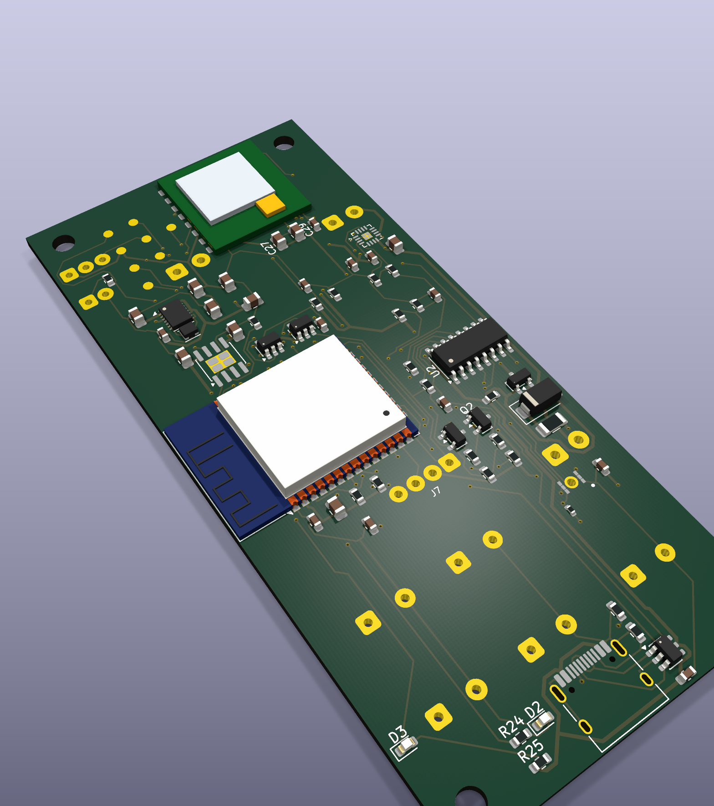
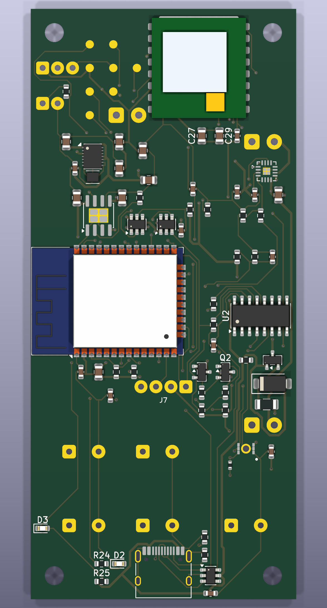
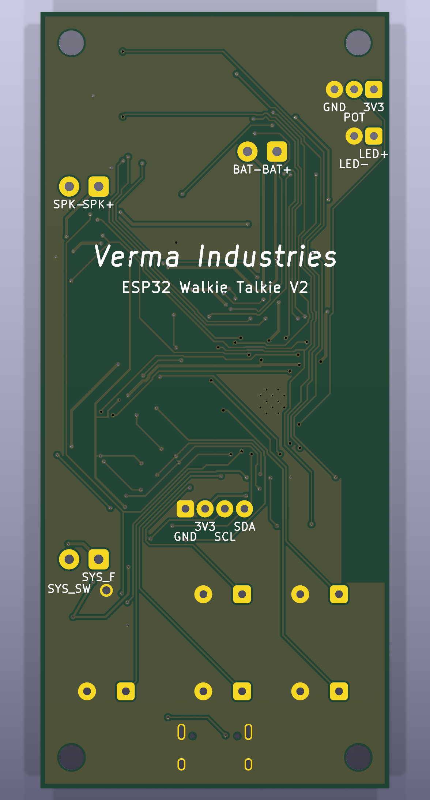

# ESP32 Walkie Talkie V2



ESP32 Walkie Talkie V2 is a custom handheld digital voice-radio board. It combines an ESP32, a dedicated 915 MHz SX1262 radio, digital microphone, Class-D speaker amplifier, battery charging, battery monitoring, USB-C programming, controls, and an external OLED connection on one 45 × 100 mm PCB.

The goal is to build a pair of rechargeable handheld radios that can exchange compressed voice without depending on Wi-Fi, cellular service, or an internet connection. The separate sub-GHz radio provides the long-range link while the ESP32 handles audio capture, compression, controls, display updates, and packet management.

> [!IMPORTANT]
> **Current status: production-candidate PCB design, not a completed physical build.** The PCB has passed ERC/DRC and manufacturing-file validation, but the enclosure and application firmware are not finished and no assembled prototype has been bench-tested yet. See [Hack Club submission status](HACK_CLUB_SUBMISSION.md) before submitting this repository for funding.

## Why this project exists

The project started as an attempt to make a longer-range, customizable alternative to a Wi-Fi-only ESP32 intercom. Designing the complete board also made it possible to choose the controls, audio path, battery monitoring and enclosure geometry instead of stacking several development boards together. A major part of the design process became learning how electrical choices affect real small-run assembly cost, stock availability, mechanical fit and manufacturability.

## What it does

- Captures digital audio with an ICS-43432 I2S microphone.
- Uses the ESP32 to process and eventually compress voice audio.
- Sends packetized audio over an Ai-Thinker Ra-01SH/SX1262 915 MHz radio.
- Drives a 4–8 Ω speaker through a MAX98357A I2S Class-D amplifier.
- Displays channel, battery, and radio state on a hand-wired SSD1306 I2C OLED.
- Provides five buttons, a potentiometer input, status LED, charging LED, and battery-voltage monitoring.
- Charges a single-cell Li-ion/LiPo battery through USB-C.

The intended voice mode is SX1262 GFSK/FSK with a low-rate codec and packet-loss handling. Ordinary LoRa modulation is useful for low-rate telemetry, but it does not provide enough continuous bandwidth for normal real-time voice.

## Hardware

| Subsystem | Part | Purpose |
|---|---|---|
| Controller | ESP32-WROOM-32D-N16 | Audio processing, controls, display and packet handling |
| Long-range radio | Ai-Thinker Ra-01SH / SX1262 | 803–930 MHz radio with I-PEX/U.FL-compatible antenna socket |
| Microphone | ICS-43432 | Bottom-port I2S digital microphone |
| Speaker amplifier | MAX98357A | I2S Class-D differential speaker output |
| Power regulator | TPS63021 | Fixed 3.3 V synchronous buck-boost supply |
| Charger | TP4056 | Approximately 500 mA single-cell Li-ion charging |
| Battery protection | DW01A + FS8205A | Cell overcharge, overdischarge and fault protection |
| USB programming | CH340C | USB-to-UART with automatic boot/reset control |
| Display | External SSD1306 module | Four hand-wired I2C holes: `SDA`, `SCL`, `3V3`, `GND` |

## Design views

| PCB front | PCB back |
|---|---|
|  |  |

The KiCad board is exactly **45.000 × 100.000 mm**, uses **two copper layers**, and includes four 3.2 mm M3 mounting holes. The OLED is mounted above the main PCB on wires or spacers, and the enclosure-mounted 40 mm speaker sits over the upper component region with its Z-clearance checked during enclosure design.

The repository currently contains a PCB STEP export, shown above. A complete enclosure CAD assembly and enclosure source file are still required for a complete Hack Club design submission.

## How the system connects

```text
Li-ion cell -> charger/protection -> power switch -> 3.3 V buck-boost -> ESP32
                                                       |            |
                                                       |            +-> OLED / controls
                                                       +-> microphone / SX1262 radio

Li-ion switched rail -------------------------------------> MAX98357A -> speaker
USB-C -> charging
USB-C -> CH340C -> ESP32 programming UART
Ra-01SH I-PEX socket -> tuned 915 MHz antenna
```

The full circuit is documented by the editable [KiCad schematic](<Schematics/Final Draft/KiCad Project/walkiepcb.kicad_sch>). Off-board wiring and mechanical assembly are described in [ASSEMBLY.md](ASSEMBLY.md).

## Intended use

Once the firmware is implemented, a user will charge each handset through USB-C, attach the correct 915 MHz antenna, turn on the side power switch, select a channel with the controls, and hold the push-to-talk button while speaking. The receiving handset will decode the packets and play the voice through its speaker.

The main switch must be on for USB programming because the CH340C intentionally runs from switched 3.3 V. Charging remains available while the switch is off. Never transmit without an antenna, and use only frequencies and power levels permitted in the operating region.

## Building the project

1. Order the matched Gerber, BOM and corrected CPL files from `Schematics/Final Draft/Manufacturing/`.
2. In the assembler preview, confirm that the ESP32 antenna faces the left board edge and the Ra-01SH matches the supplied render.
3. Inspect and electrically bring up one board using the [first-power-up checklist](<Schematics/Final Draft/KiCad Project/FIRST_POWER_UP_CHECKLIST.md>).
4. Hand-solder the OLED, five buttons, potentiometer, speaker, battery, external LED and power switch according to [ASSEMBLY.md](ASSEMBLY.md).
5. Design and print/machine an enclosure that secures the PCB, speaker, battery, display, antenna cable and controls.
6. Flash and test the application firmware before installing the battery permanently.

The validated release files and exact upload instructions are in [Schematics/Final Draft](<Schematics/Final Draft>). Machine validation for that release reports **ERC 0 errors/0 warnings, DRC 0 violations/0 unconnected pads, and 64/64 BOM/CPL reference parity**.

## Repository map

- [`Schematics/Final Draft`](<Schematics/Final Draft>) — order-candidate KiCad source, Gerbers, BOM, corrected CPL, renders and audit reports
- [`Schematics/KiCad Project`](<Schematics/KiCad Project>) — editable working KiCad project and engineering notes
- [`CAD`](CAD) — PCB STEP export; enclosure CAD is still pending
- [`Firmware`](Firmware) — firmware status and planned architecture
- [`DESIGN_JOURNAL.md`](DESIGN_JOURNAL.md) — dated Hack Club-style build journal
- [`docs/ENGINEERING_HISTORY.md`](docs/ENGINEERING_HISTORY.md) — detailed engineering decisions, mistakes and corrections
- [`BOM.csv`](BOM.csv) — root project-level funding BOM
- [`ASSEMBLY.md`](ASSEMBLY.md) — off-board wiring and build plan
- [`HACK_CLUB_SUBMISSION.md`](HACK_CLUB_SUBMISSION.md) — submission checklist and known blockers

## Project BOM

This budget builds a **pair of handsets** so that the radio link can be tested. Prices are planning estimates in USD and exclude shipping/tax. The PCBA line covers the two-board assembled prototype order; the [engineering BOM](<Schematics/Final Draft/KiCad Project/walkiepcb_bom_full.csv>) lists every installed component and JLC/LCSC number.

| Item | Qty | Est. unit | Est. total | Source / part |
|---|---:|---:|---:|---|
| Two assembled PCBs plus fabrication minimum | 1 lot | $105.00 | $105.00 | [JLCPCB](https://jlcpcb.com/); use the files in `Schematics/Final Draft/Manufacturing/` |
| 0.96-inch SSD1306 I2C OLED | 2 | $8.00 | $16.00 | [Waveshare 0.96-inch OLED (B)](https://www.waveshare.com/0.96inch-oled-b.htm) |
| 40 mm, 4–8 Ω speaker | 2 | $2.00 | $4.00 | [Adafruit 4 Ω 3 W speaker](https://www.adafruit.com/product/3968) or equivalent |
| Protected 1S LiPo battery | 2 | $12.50 | $25.00 | [Adafruit 2000 mAh LiPo](https://www.adafruit.com/product/2011) or enclosure-compatible protected cell |
| 868/915 MHz flexible antenna with I-PEX/U.FL | 2 | $8.00 | $16.00 | Taoglas `FXP75.07.0100A` or equivalent 50 Ω antenna |
| 6 × 6 mm two-pin tactile buttons | 10 | $0.25 | $2.50 | `TL1100F100QG` or footprint-compatible equivalent |
| 10 kΩ linear potentiometer | 2 | $1.00 | $2.00 | Generic panel-mount B10K potentiometer |
| SPST power switch | 2 | $1.00 | $2.00 | Generic panel-mount switch rated above 2 A DC |
| 5 mm external LED | 2 | $0.10 | $0.20 | Generic LED; board includes a 330 Ω resistor |
| Wire, heat-shrink and mounting hardware | 1 lot | $5.00 | $5.00 | Generic hookup materials and M3 hardware |
| Enclosure material | 2 | TBD | TBD | Pending complete enclosure CAD |
| **Estimated subtotal before enclosure/shipping/tax** |  |  | **$177.70** |  |
