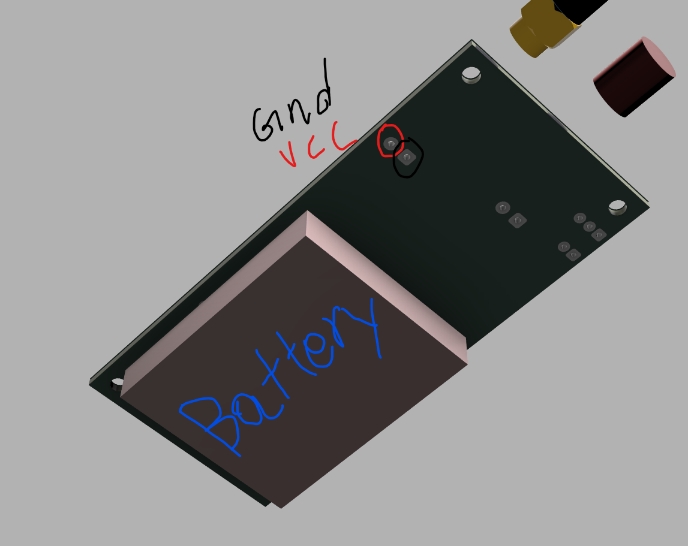
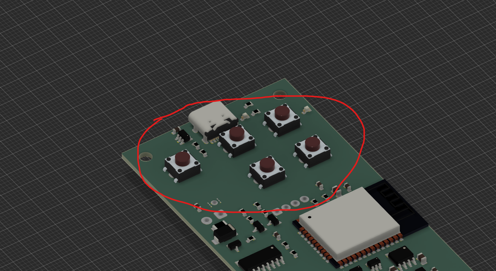
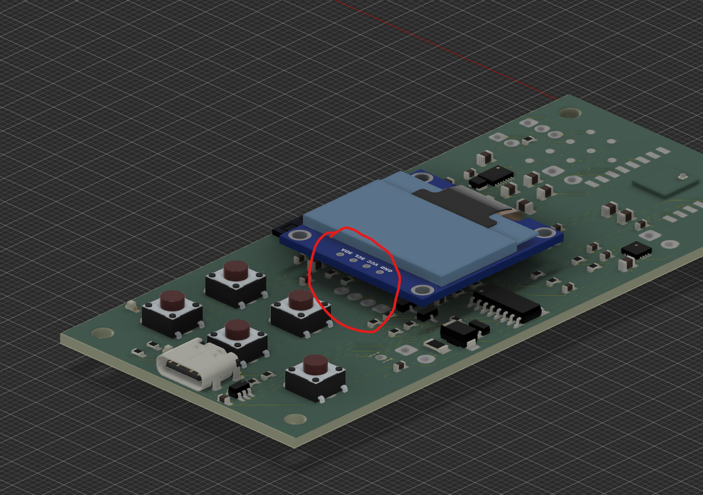
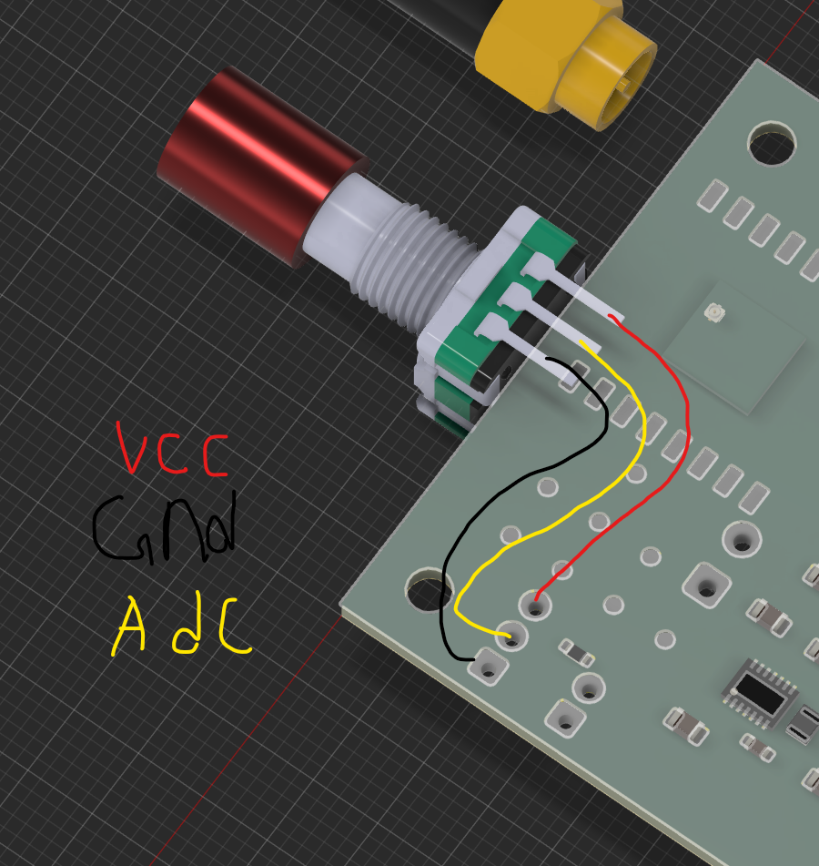
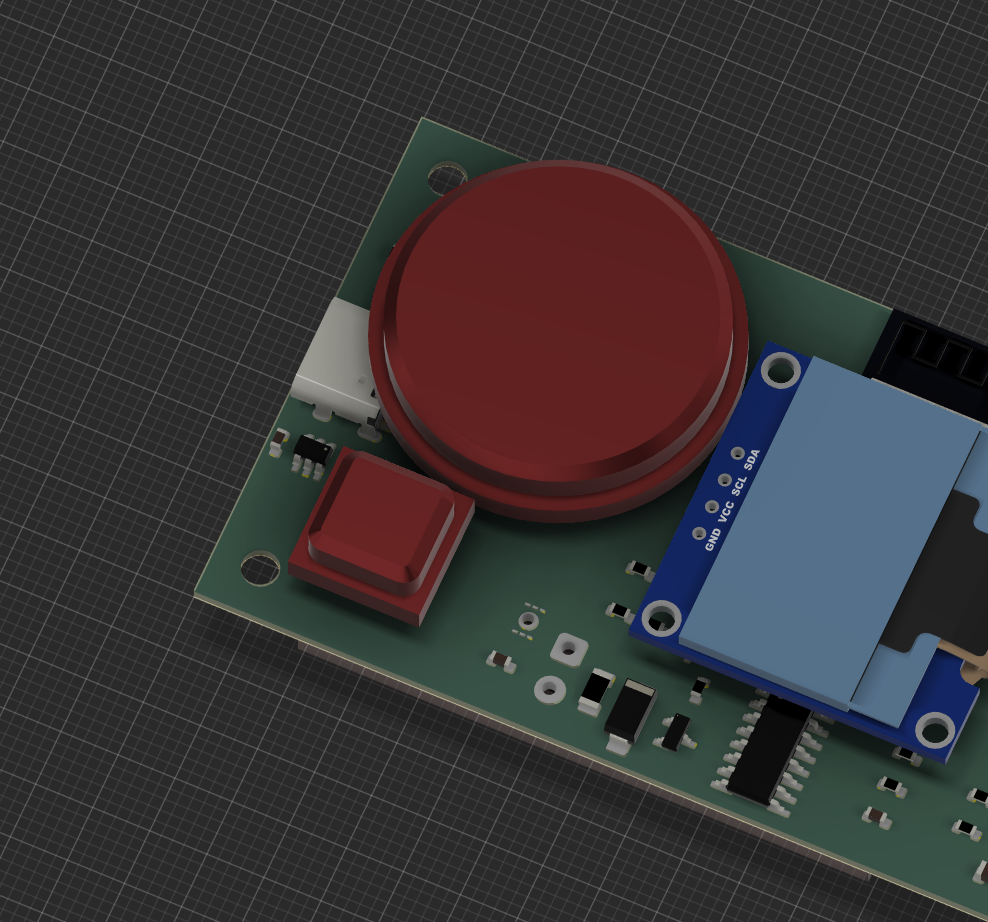
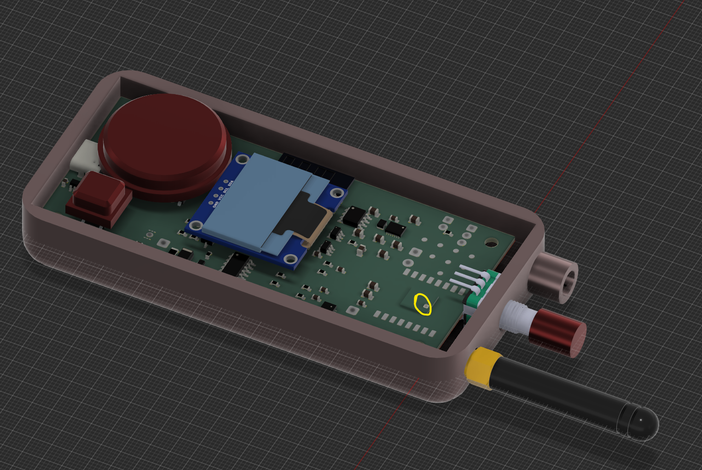
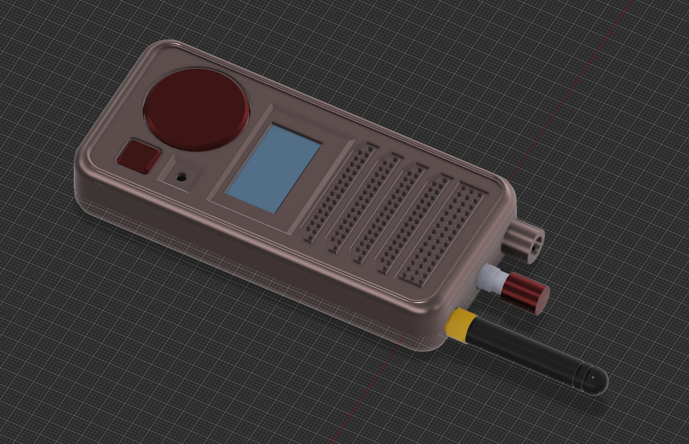

# Walkie Talkie Instructions

1. You must get the lipo battery and solder its wires to the input of the pcb

2. Then, solder all 5 buttons using the through holes in the pcb

3. Next, solder on the OLED display through the 4 pin slot

4. Next, solder on the potentiometer looking at the diagram below

5. Print the button pad, and button press stls, and put them as shown in the picture on top of the buttons 

6. Print the case bottom stl and put everything on there. Use a UFL connector with the SX1262 to connect to the radio antenna

7. Print the case lid and use super glue to add it on

