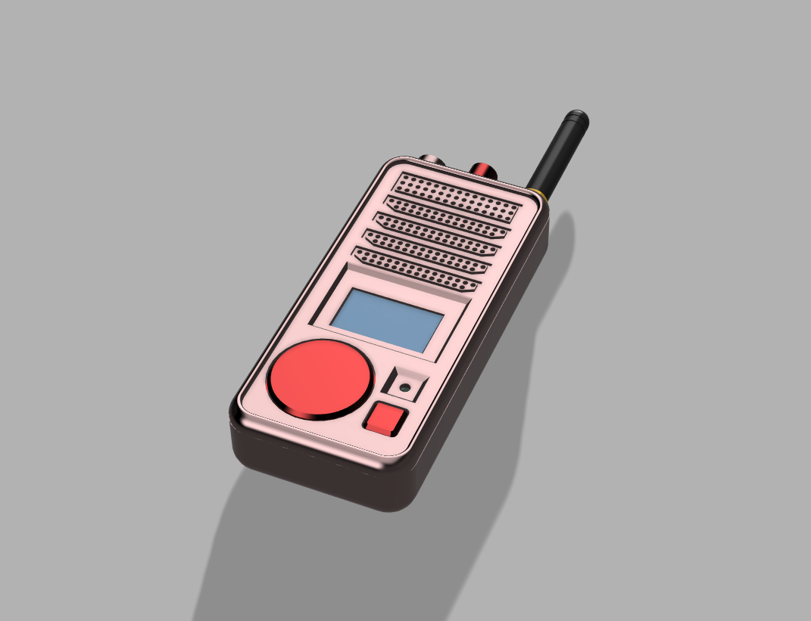
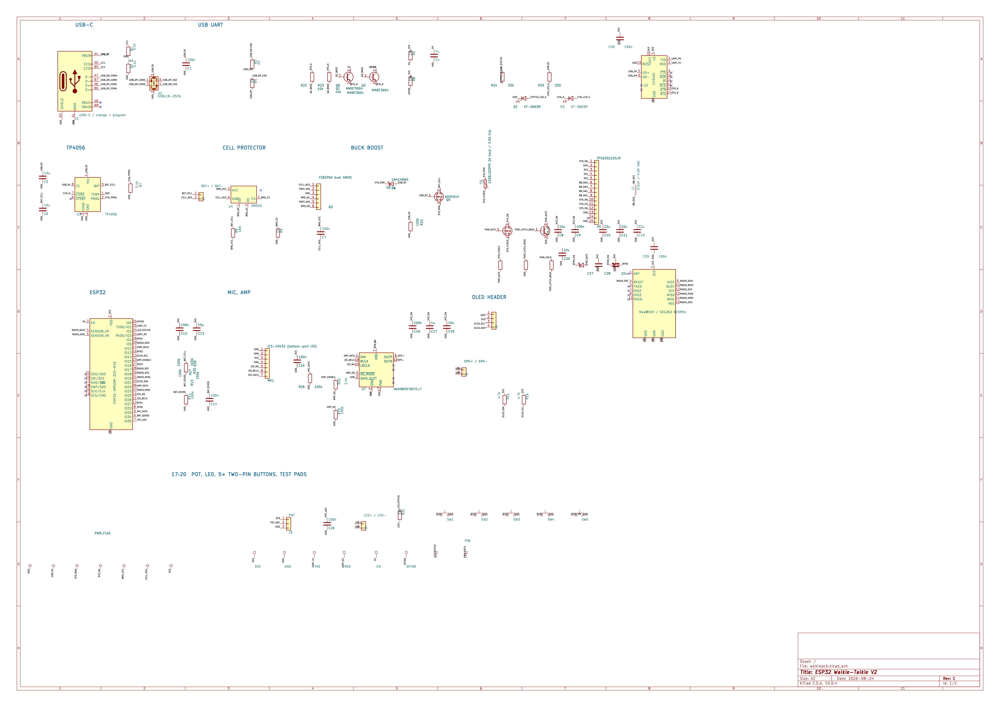

# ESP32 Walkie Talkie V2

This project is submitted to review at forge; And also, I have made a similar ESP32 based walkie talkie in the past. This is an iteration and is significantly different from the old version. It uses a custom PCB, new and different components, communication protocols, radios, and CAD/casing. It is a much needed iteration from my old version which was very difficult to hard wire and prone to several mistakes.

## Instructions

Build instructions are at: [instructions.md](instructions.md)

## Why this project exists

I made this projet not because I just wanted a walkie talkie, I wanted a control interface for my other projects. Not only can I use this board as a walkie talkie, I can use it in my other projects for other types of communications as the PCB is basically a built in radio system, which I can connect to another system using uart and use it for several other purposes. It has a LORA SX1262 radio, with 5-10km range, but at the same time has a ESP32 with WIFI+BLUETOOTH. I can use this for IoT long distance, and connect wifi/bluetooth devices and extend their range significantly using the radio. This is different from walkie talkies already out there.

## Features

- Can be used for IOT (Wifi + Bluetooth) long distance when paired with the 915mhz radio
- 5 Buttons to do multiple things 
- Exposed pins to connect pheripherals, such as an IMU
- ICS-43432 I2S microphone, MAX98753A amplifier, SSD1306 0.96" OLED, SX1262 RADIO, ESP32WROOM32-16
- Potentiometer, battery charge detection, TP4056 charging, 2000MAH Lipo, 10H batery life

## Hardware

In the Schematics folder is the GERBER+BOM+CPL file for easy PCBA assembly of this board. The KiCad project is also there.

## Firmware

I have included a basic micropython test file for using the walkie talkie when assembled with its radio. It is just a prototype and not complete. I will likely make a full firmware by porting it from my old walkie talkie build and using it as a tempalte.

## Project BOM

| Item | Qty/walkie | Pack | Pack price | Per piece | Cost/walkie | Source / note |
|---|---:|---:|---:|---:|---:|---|
| Assembled walkie-talkie PCB | 1 | 5 | $167.97 | $33.5940 | $33.5940 | [Five-PCBA quote](assets/jlc-quote-5-pcba.png); includes PCB components assembly |
| 0.96-inch SSD1306 I2C OLED | 1 | 5 | $8.83 | $1.7660 | $1.7660 | [AliExpress OLED](https://www.aliexpress.us/item/3256805954920554.html) |
| 804050 2000 mAh 3.7 V LiPo | 1 | 4 | $16.60 | $4.1500 | $4.1500 | [AliExpress battery pack](https://www.aliexpress.us/item/3256812605593313.html)|
| 915 MHz 2 dBi antenna with I-PEX/U.FL lead | 1 | 4 | $5.66 | $1.4150 | $1.4150 | [AliExpress antenna](https://www.aliexpress.us/item/3256805050972049.html)|
| 6 × 6 × 5 mm tactile push button | 5 | 50 | $1.28 | $0.0256 | $0.1280 | [AliExpress button pack](https://www.aliexpress.us/item/3256805859865632.html) |
| 0.5 W ultra-slim speaker | 1 | 5 | $2.43 | $0.4860 | $0.4860 | [AliExpress speaker](https://www.aliexpress.us/item/3256809614775479.html) |
| 20 kΩ panel potentiometer | 1 | 5 | $1.86 | $0.3720 | $0.3720 | [AliExpress potentiometer](https://www.aliexpress.us/item/2255799926052367.html) |
| Printed Casing, Wires, and Screws | 1 Set | 1 | $0 | $0 | $0 | Use available filament, wire and m3 screws or glue. |
| 650 nm 5 mW laser module | 1 | 10 | $2.83 | $0.2830 | $0.2830 | [AliExpress laser module](https://www.aliexpress.us/item/3256806548478140.html) |
| **Complete cost per walkie-talkie** |  |  |  |  | **$42.1940 (~$42.19)** | Per-unit|

### What I would do differently in the future / future plans

- I would make it thinner
- Use more dense parts for smaller size (with a stronger budget)
- Make it fully waterproof
